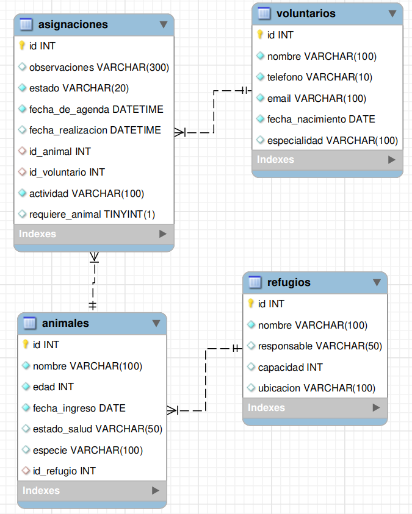

# MODELO ENTIDAD RELACION DE LA BASE DE DATOS
Este proyecto es una aplicación desarrollada en Java que permite gestionar voluntarios y refugios de animales, 
facilitando el registro, actualización, asignación y seguimiento de voluntarios dentro de distintos refugios. 
La aplicación utiliza JDBC para la conexión con una base de datos MySQL, 
asegurando persistencia de la información y operaciones confiables.

Tablas principales:

voluntarios: información de los voluntarios.

refugios: información de los refugios.

asignaciones: relación entre voluntarios y animales.

animales: información de los animales.

# MODELO ENTIDAD RELACION DE LA BASE DE DATOS



## Script de la Base de Datos

El siguiente script crea la base de datos y todas las tablas necesarias con sus relaciones y restricciones:

```sql
-- Crear la base de datos
CREATE DATABASE IF NOT EXISTS nombre_de_tu_base_de_datos;
USE nombre_de_tu_base_de_datos;

-- Crear tabla 'refugios'
CREATE TABLE IF NOT EXISTS refugios (
    id INT AUTO_INCREMENT NOT NULL PRIMARY KEY,
    nombre VARCHAR(100) NOT NULL UNIQUE,
    responsable VARCHAR(50),
    capacidad INT,
    ubicacion VARCHAR(100)
);

-- Crear tabla 'animales'
CREATE TABLE IF NOT EXISTS animales (
    id INT AUTO_INCREMENT NOT NULL PRIMARY KEY,
    nombre VARCHAR(100) NOT NULL,
    edad INT NOT NULL,
    fecha_ingreso DATE NOT NULL,
    estado_salud VARCHAR(50),
    especie VARCHAR(100),
    id_refugio INT,
    FOREIGN KEY (id_refugio) REFERENCES refugios(id)
);

-- Crear tabla 'voluntarios'
CREATE TABLE IF NOT EXISTS voluntarios (
    id INT AUTO_INCREMENT NOT NULL PRIMARY KEY,
    nombre VARCHAR(100) NOT NULL,
    telefono VARCHAR(10) UNIQUE NOT NULL,
    email VARCHAR(100) UNIQUE NOT NULL,
    fecha_nacimiento DATE NOT NULL,
    especialidad VARCHAR(100)
);

-- Crear tabla 'asignaciones'
CREATE TABLE IF NOT EXISTS asignaciones (
    id INT AUTO_INCREMENT NOT NULL PRIMARY KEY,
    observaciones VARCHAR(300),
    estado VARCHAR(20) NOT NULL,
    fecha_de_agenda DATETIME NOT NULL,
    fecha_realizacion DATETIME,
    id_animal INT,
    id_voluntario INT,
    actividad VARCHAR(100) NOT NULL,
    requiere_animal BOOLEAN,
    FOREIGN KEY (id_animal) REFERENCES animales(id),
    FOREIGN KEY (id_voluntario) REFERENCES voluntarios(id)
);

